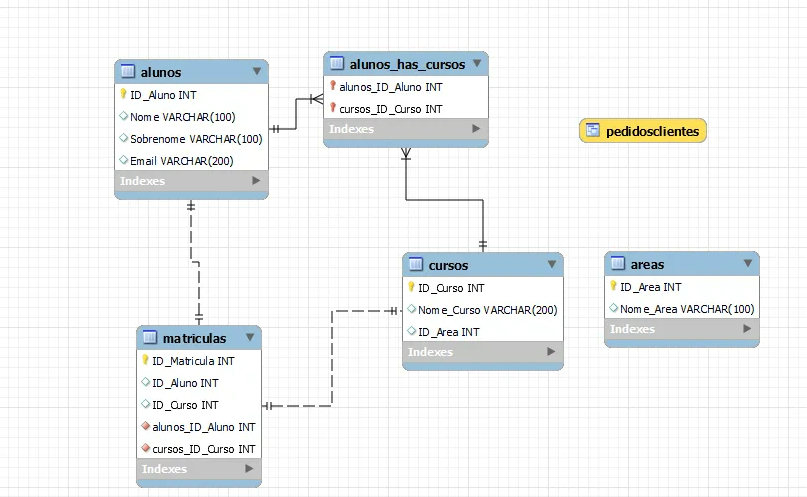

# Sistema de Universidades

Este é um sistema de gestão acadêmica simplificado, utilizando um banco de dados relacional. O sistema possui quatro tabelas principais: `Areas`, `Cursos`, `Alunos`, e `Matriculas`. Ele também inclui três procedimentos armazenados (`InserirCurso`, `BuscarIDCurso`, `MatricularAluno`) e uma função (`BuscarIDCurso`) para interações específicas.

## Estrutura do Banco de Dados

### Tabelas

1. **Areas**
   - `ID_Area` (Chave Primária)
   - `Nome_Area` (Único)

2. **Cursos**
   - `ID_Curso` (Chave Primária)
   - `Nome_Curso`
   - `ID_Area` (Chave Estrangeira referenciando `Areas`)

3. **Alunos**
   - `ID_Aluno` (Chave Primária)
   - `Nome`
   - `Sobrenome`
   - `Email` (Único)

4. **Matriculas**
   - `ID_Matricula` (Chave Primária)
   - `ID_Aluno` (Chave Estrangeira referenciando `Alunos`)
   - `ID_Curso` (Chave Estrangeira referenciando `Cursos`)
   - `Data_Matricula` (Padrão para a data atual)

### Inserção de Dados de Exemplo

O sistema inclui inserções de dados de exemplo para as tabelas `Areas`, `Cursos`, `Alunos`, e `Matriculas`.

## Procedimentos Armazenados e Funções

### InserirCurso

O procedimento `InserirCurso` permite a inserção de novos cursos no sistema. Ele recebe o nome do curso e o ID da área como parâmetros.

### BuscarIDCurso

A função `BuscarIDCurso` retorna o ID de um curso com base no nome do curso e no nome da área. Se o curso não for encontrado, a função retorna NULL.

### MatricularAluno

O procedimento `MatricularAluno` realiza a matrícula de um aluno em um curso específico. Ele recebe o ID do aluno, o nome do curso e o nome da área como parâmetros. Verifica se o aluno já está matriculado no curso antes de efetuar a matrícula.
